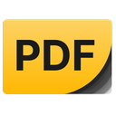
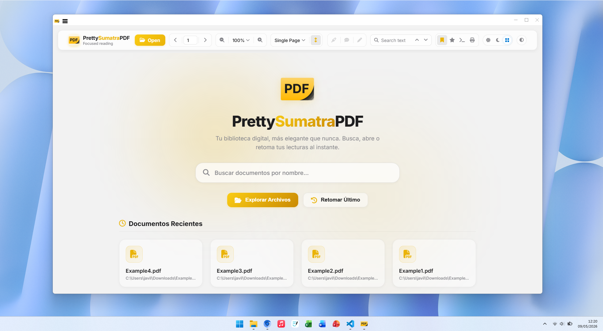
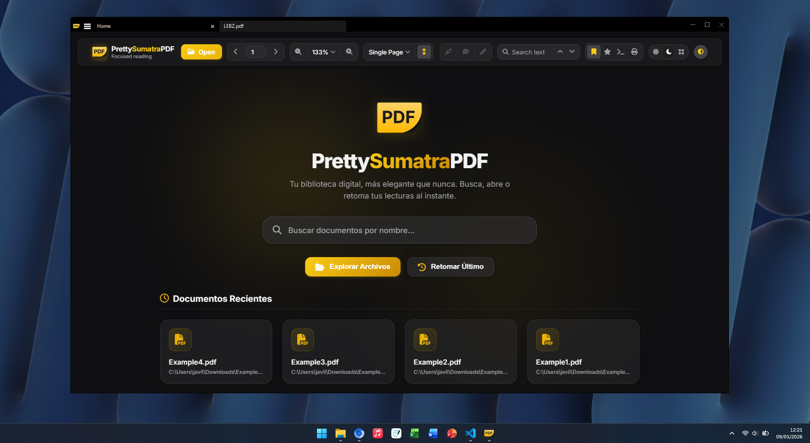
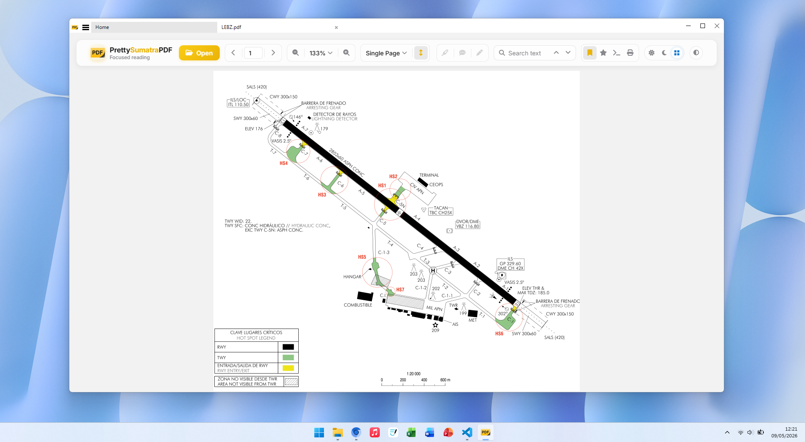
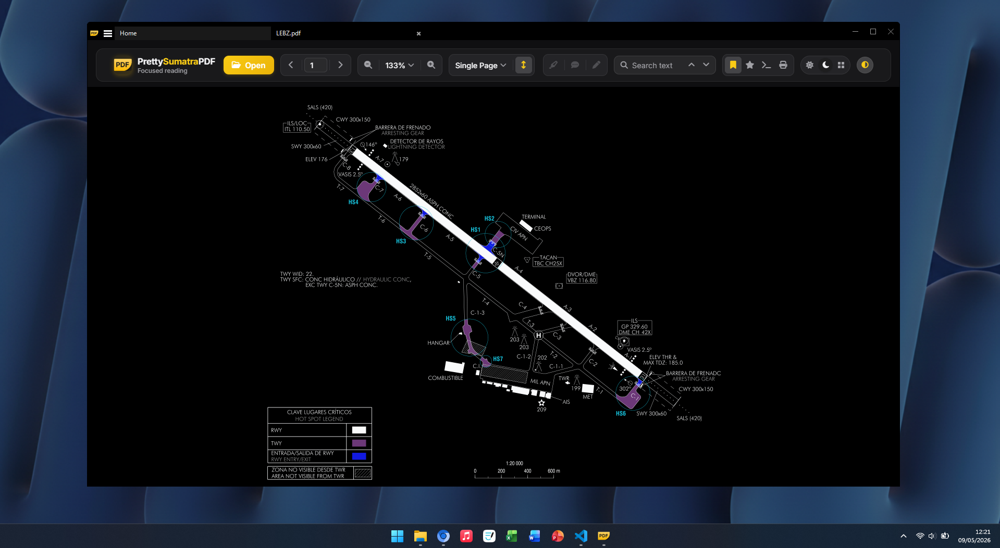

  
  <h1>PrettySumatraPDF</h1>

**PrettySumatraPDF** is a modern redesign of the classic SumatraPDF reader, bringing a fresh Windows 11-style interface while maintaining 100% of the original functionality and features.

### What is PrettySumatraPDF?

PrettySumatraPDF reimagines the SumatraPDF experience with:

- **Modern Native UI**: A Windows 11-inspired design philosophy applied to the native Win32 toolbar and interface
- **Zero Functionality Loss**: All original features and capabilities are fully preserved
- **Hybrid Architecture**: Combines native Win32 rendering with optional WebView2 for advanced UI components
- **Clean Aesthetic**: Refined visual design with rounded corners, modern color tokens, and contemporary spacing
- **Performance Focused**: Optimized rendering core maintains the lightweight, fast performance SumatraPDF is known for

### Features

PrettySumatraPDF supports all original SumatraPDF formats:
- **Documents**: PDF, EPUB, MOBI, CBZ, CBR, FB2, CHM, XPS, DjVu
- **Editing**: Annotations with saved/unsaved state tracking
- **Navigation**: Command palette, tabs, bookmarks, table of contents
- **Tools**: Text extraction, translation, search, zoom controls
- **Customization**: Keyboard shortcuts, theme support, settings management

## Maintanibality and Contributions

PrettySumatraPDF is an open-source project licensed under the same terms as SumatraPDF (A)GPLv3, with some code under BSD license. Contributions are welcome! For more information on how to contribute, please visit the [Developer Information](https://www.sumatrapdfreader.org/docs/Contribute-to-SumatraPDF) page.

My goal with PrettySumatraPDF is to create a visually appealing and modernized version of SumatraPDF while ensuring that all existing features and functionalities remain intact. I am committed to maintaining the core principles of SumatraPDF, including its lightweight nature and fast performance, while enhancing the user experience with a fresh design.

I am committed to update PrettySumatraPDF with the latest features and improvements from the original SumatraPDF project, ensuring that users can enjoy the best of both worlds: a modern interface and the full functionality of the classic reader.

### Screenshots

#### Home Screen

##### Light Theme

##### Dark Theme

#### Toolbar

##### Light Theme

##### Dark Theme

---

## 📖 SumatraPDF Reader

SumatraPDF is a multi-format (PDF, EPUB, MOBI, CBZ, CBR, FB2, CHM, XPS, DjVu) reader
for Windows under (A)GPLv3 license, with some code under BSD license (see
AUTHORS).

### More Information

* [Website](https://www.sumatrapdfreader.org/free-pdf-reader)
* [Manual](https://www.sumatrapdfreader.org/manual)
* [Developer Information](https://www.sumatrapdfreader.org/docs/Contribute-to-SumatraPDF)
